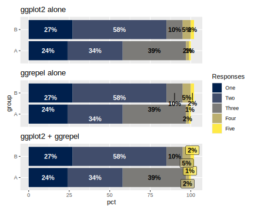

# A nice way to fit all bar labels

Here are three ways to label the bars on a stacked barplot. The one I like best (for now) uses both `ggplot2::geom_text()` and `ggrepel::geom_label_repel()` conditionally based on bar size. This way, only labels that don't fit are repelled.

Here's the output:

